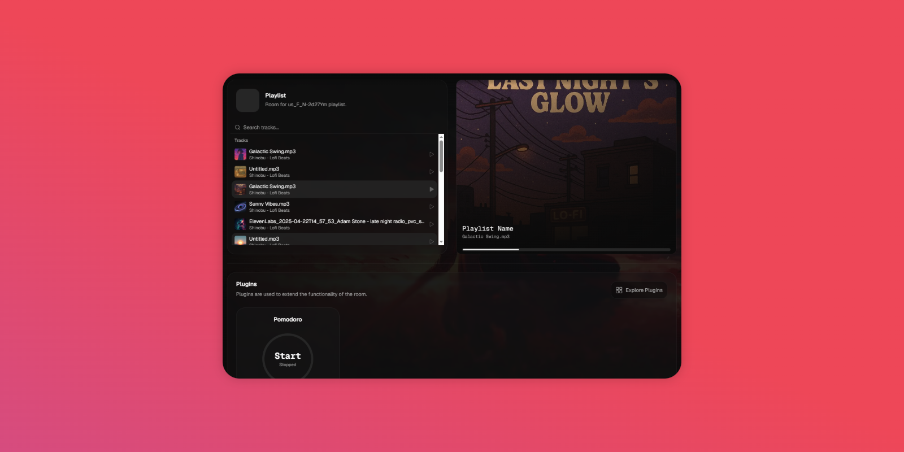
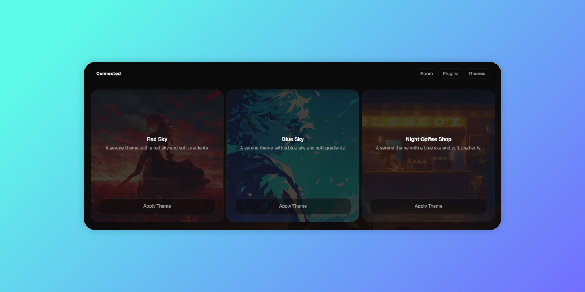
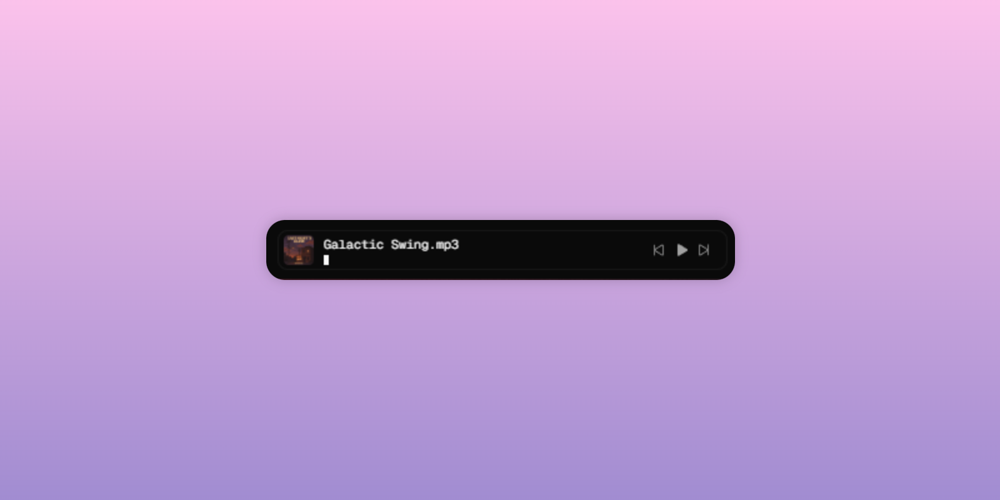

# 🌊 lofi.surf

A calm, minimal Lo-Fi streaming app — powered entirely by AI.

> 🎧 Built for developers who work better in flow. No ads, no noise — just ambient vibes generated on the fly.

---

## 🤖 AI-Generated, End to End

`lofi.surf` is fully driven by generative AI.  
Every track is created in real-time — no uploads, no licensing. Just infinite chill, coded into existence.

---

## 🧘 Features

- 🎵 **AI-generated Lo-Fi** — infinite music, zero repetition  
- 🖤 **Dark mode only** — optimized for deep work  
- 🖥️ **Personal streaming room** — each user has their own vibe  
- 🎛️ Minimal UI with keyboard shortcuts  
- 📱 Responsive design, from desktop to mobile

---

## 💸 Coming Soon

> 🎨 Theming + custom vibes  
> 🔓 Unlock visual packs, moods, and ambient styles for your personal room  
> 💼 Premium plans for focused creators

---

## 🚀 Tech Stack

- **React + Next.js**
- **Tailwind CSS**
- **Radix UI / Shadcn UI**
- **TypeScript**
- **AI Music backend (custom pipeline)**

---

## 📸 Screenshots

🎧 **Personal Streaming Room**

🎨 **Minimal UI & Themes** 

🖥️ **Minimal Global Player**  

🔌 **Extensive Plugin Support**

---

## ⌨️ Keyboard Shortcuts

| Action         | Shortcut       |
|----------------|----------------|
| Toggle full-screen | `F`            |
| Change theme       | `→` (right arrow) |
| Play/Pause         | `Space`        |

---

## 💡 Vision

`lofi.surf` is a focused audio experience designed for builders.  
Whether you’re coding, designing, or just vibing — the music adapts to your moment.

---

## 🧑‍💻 Author

Created by [@kodiyak](https://github.com/kodiyak)  
Explore my other open-source tools:  
[shadcn.cloud](https://github.com/kodiyak/shadcn-cloud) · [modpack](https://github.com/kodiyak/modpack)

---

## 📃 License

MIT — the app is open-source, the vibe is eternal.  
All music is AI-generated and served dynamically.

---
